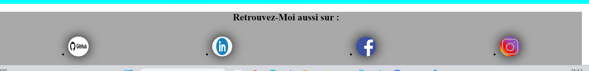
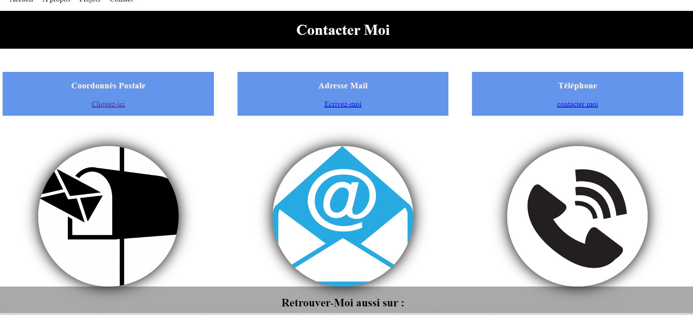

# MONPORTOFOLIO

## Description
Mon projet consiste a me décrire sur le plan personnel, professionnel et mes envies pour le futur.
j'ai crée des pages avec des fonctionnalités qui expliqueront en details mon Portofolio 

## Fonctionnalités
- **Page d'accueil**
vous verrez dans ma page d'acceuil une présentation assez rapide avec des photos qui vous enverrons sur des videos .

Vidéo interactive sur la page d'accueil:En cliquant sur une image, une vidéo explicative se lance, permettant d'en savoir plus sur les métiers exercés dans mon parcours professionnel.

[](https://vimeo.com/1029693088?share=copy#t=0)

sur la fin de toutes les pages **Page d'accueil**, **A propos**, **projets**, **Contact**,  j'ai mis quelque liens de site qui se concorde à ma vie personnel et mes recherches professionnelles en cliquant sur les photos vous serez dirigés sur les sites en questions:
voici la capture d'ecran avec un lien video explicative:

[](https://vimeo.com/1029710347?share=copy#t=0)


 **Header**
 dans la page **Header** elle est assez simple j'ai mis des liens en cliquant sur ses liens elle se dirige directement sur les pages demandés le **Header** est visible sur toutes les pages : **Page d'accueil**, **A propos**, **Projet**, **contact**.

 [](https://vimeo.com/1029728161?share=copy#t=0)

**À propos, Projets**.
Pour les pages **À propos** **Projets** et sont des pages similaires au niveau de la présentation avec trois photos sur chaque page quand on clique sur la photo ça nous renvoi sur un lien qui décrit l'image sélectionné 
sur la page **À propos** elle décrit ma vie personnelle 
// // // // **Projets** elle décrit ma vie professionnelle.

[](https://vimeo.com/1029734835?share=copy#t=0)


 **Contact**
 sur cette page j'ai mis mes coordonnées adresse postale, mail et téléphone il ne sont pas mentionné sur le site il faut cliquer sur le lien qui vous redirige sur des site qui indiquent que vous pouviez me contacter par mail ou téléphone .
 le lien de l'adresse postale vous dirige sur un site en indiquant l'adresse et le parcours pour y acceder .

 [](https://vimeo.com/1029742193?share=copy#t=0)

 **Affichage de la page d'erreur 404 pour les liens inexistants.**
 j'ai crée un lien inexistant au moment qu'on est sur un page **Projet** sur le **Header** on ne peut cliquer sur **projet** il t'affiche la page d'erreur 404 

[](https://vimeo.com/1029745750?share=copy#t=0)
 


## Installation

1. Clonez le dépôt :
   ```bash
   git clone https://github.com/votre-utilisateur/nom-du-projet.git

